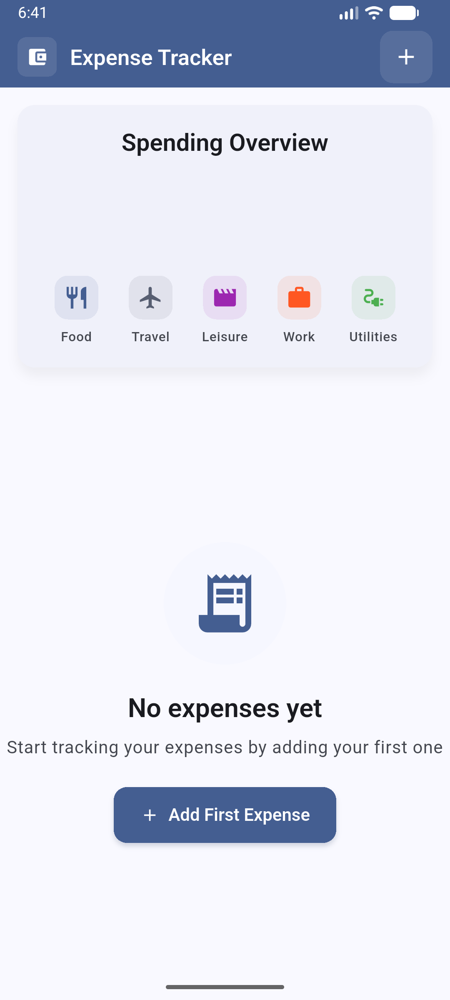
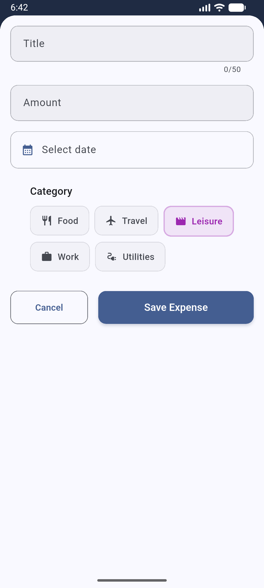
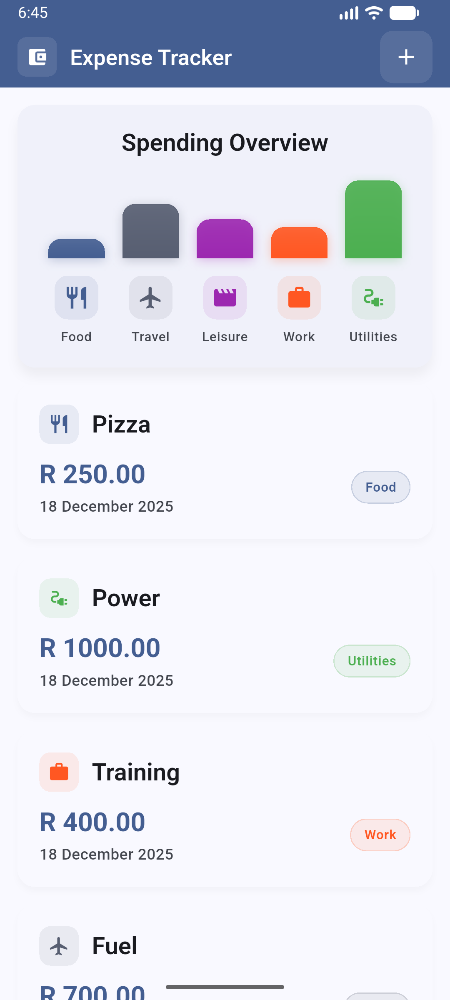
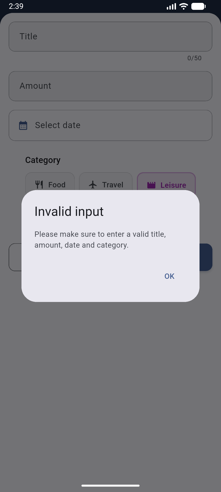

# 💰 Expense Tracker

[](https://flutter.dev)
[](https://dart.dev)
[](https://opensource.org/licenses/MIT)
[](https://flutter.dev)

A beautiful, cross-platform expense tracking application built with Flutter and Material 3 design. Track your spending, categorize expenses, and visualize your financial habits with interactive charts.

## ✨ Features

-   **📊 Expense Categorization** - Organize expenses into 5 categories: Food, Travel, Leisure, Work, and Utilities
-   **📈 Visual Analytics** - Interactive charts to visualize spending patterns and trends
-   **➕ Expense Management** - Add, edit, and delete expenses with intuitive UI
-   **🎨 Material 3 Design** - Modern design with support for both light and dark themes
-   **📱 Cross-Platform** - Runs on Android, iOS, Web, and Desktop platforms
-   **🔄 Real-time Updates** - Reactive state management with Provider pattern
-   **💾 Local Storage** - Persistent expense data with unique identifiers
-   **🌐 Responsive UI** - Adaptive layout that works on all screen sizes

## 📸 Screenshots






## 🚀 Installation & Setup

### Prerequisites

-   **Flutter SDK**: `>=3.3.0 <4.0.0`
-   **Dart SDK**: `>=3.3.0 <4.0.0`

### Installation

1. **Clone the repository**

    ```bash
    git clone https://github.com/Spectari-code/expense-tracker.git
    cd expense-tracker
    ```

2. **Install dependencies**

    ```bash
    flutter pub get
    ```

3. **Verify setup**
    ```bash
    flutter doctor
    ```

### Platform-Specific Setup

#### Android Development

```bash
# Install Android Studio and SDK
# Accept Android SDK licenses
flutter doctor --android-licenses
```

#### Web Development

```bash
# Install Chrome browser
# Run on web
flutter run -d chrome
```

#### Desktop Development (Linux/Mac/Windows)

```bash
# Enable desktop support
flutter config --enable-linux-desktop   # Linux
flutter config --enable-macos-desktop   # macOS
flutter config --enable-windows-desktop # Windows
```

## 💻 Usage

### Running the App

```bash
# Run on connected device/emulator
flutter run

# Run on specific platforms
flutter run -d android  # Android
flutter run -d ios      # iOS
flutter run -d chrome   # Web
flutter run -d linux    # Linux Desktop
```

### Basic Usage

1. **Launch the app** - The main screen shows your expense list and summary
2. **Add expenses** - Tap the "+" button to add new expenses with category selection
3. **View analytics** - Check the charts section for spending visualization
4. **Edit/Delete** - Long press expenses to modify or remove them
5. **Theme toggle** - Switch between light and dark themes (follows system preference)

## 🏗️ Project Structure

```
lib/
├── main.dart                    # App entry point with Provider setup
├── theme.dart                   # Light/dark theme configuration
├── data/
│   └── models/
│       └── expense.dart         # Expense data model with categories
├── viewmodels/
│   └── expense_viewmodel.dart   # State management with ChangeNotifier
└── views/
    ├── screens/
    │   └── expenses_screen.dart # Main screen with expense list
    └── widgets/
        ├── chart/               # Chart components for analytics
        ├── expenses_list/       # Expense list and item widgets
        └── new_expense.dart     # Add/edit expense form
```

### Architecture

This app follows the **MVVM (Model-View-ViewModel)** architectural pattern:

-   **Models** (`data/models/`): Data structures and business logic
-   **ViewModels** (`viewmodels/`): State management and data transformation
-   **Views** (`views/`): UI components and screens

State management is handled by **Provider** with `ChangeNotifier` for reactive updates.

## 🛠️ Development

### Build Commands

```bash
# Lint and analyze code
flutter analyze

# Format code
dart format .

# Apply automatic fixes
dart fix --apply

# Run all tests
flutter test

# Run single test file
flutter test path/to/test_file.dart

# Build APK for Android
flutter build apk
```

### Code Quality

-   **Linting**: `flutter analyze`
-   **Formatting**: `dart format .`
-   **Testing**: `flutter test`
-   **Fixes**: `dart fix --apply`

### Dependencies

-   `provider: ^6.1.5+1` - State management
-   `intl: ^0.20.2` - Internationalization and date formatting
-   `uuid: ^4.3.3` - Unique expense identifiers

## 🤝 Contributing

We welcome contributions! Please follow these guidelines:

### Code Style

-   **Imports**: Use relative imports within `lib/`, absolute imports for external packages
-   **Formatting**: Line length ≤ 80 characters, use `dart format`
-   **Types**: Strong typing with null safety throughout
-   **Naming**:
    -   Variables/functions: `camelCase`
    -   Classes/enums: `PascalCase`
    -   Files: `snake_case`
-   **Constructors**: Use `const` constructors for widgets where possible
-   **Error Handling**: Use try-catch blocks with meaningful error messages

### Development Workflow

1. Fork the repository
2. Create a feature branch: `git checkout -b feature/your-feature`
3. Make your changes following the code style guidelines
4. Run tests: `flutter test`
5. Format code: `dart format .`
6. Lint code: `flutter analyze`
7. Commit your changes: `git commit -m "Add: your feature description"`
8. Push to your branch: `git push origin feature/your-feature`
9. Create a Pull Request

## 📄 License

This project is licensed under the MIT License - see the [LICENSE](LICENSE) file for details.

## 📞 Contact

-   **GitHub**: [Spectari-code](https://github.com/Spectari-code)
-   **Website**: [theovisagie.com](https://theovisagie.com)

---

Built with ❤️ using [Flutter](https://flutter.dev)
